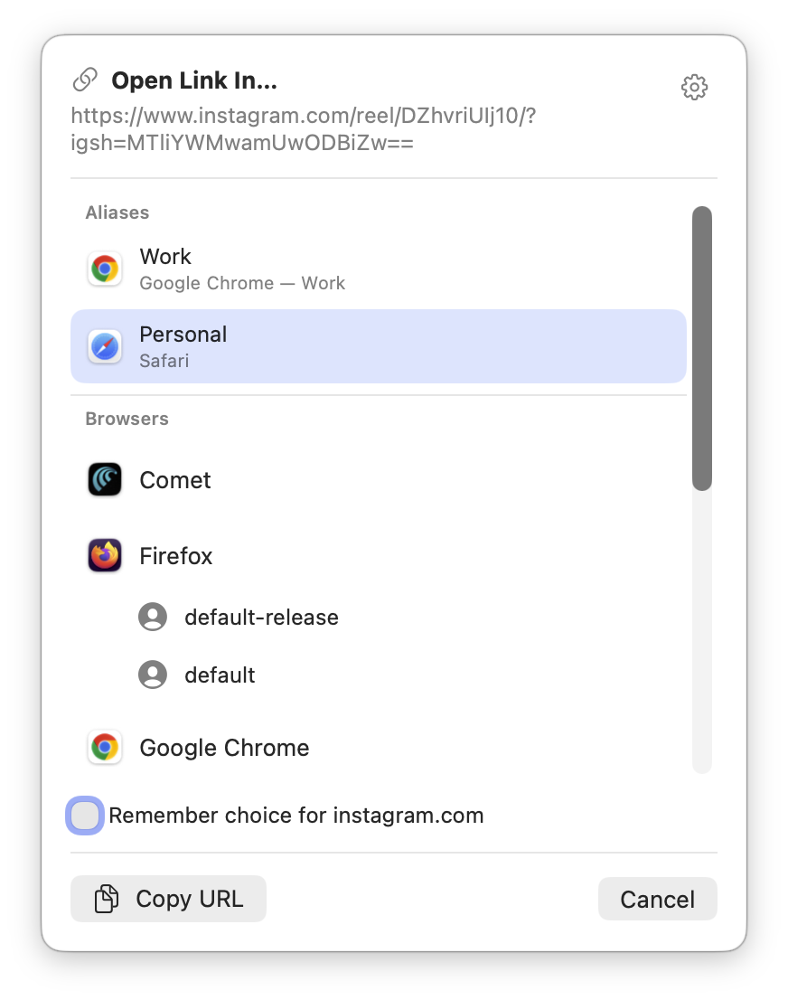
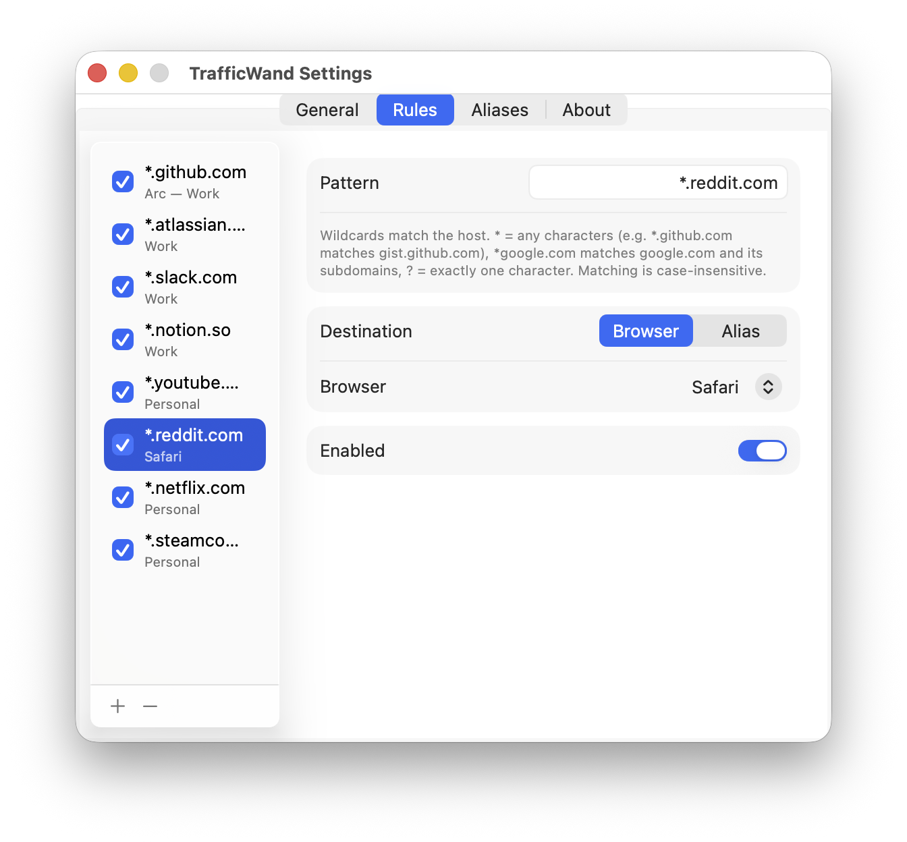
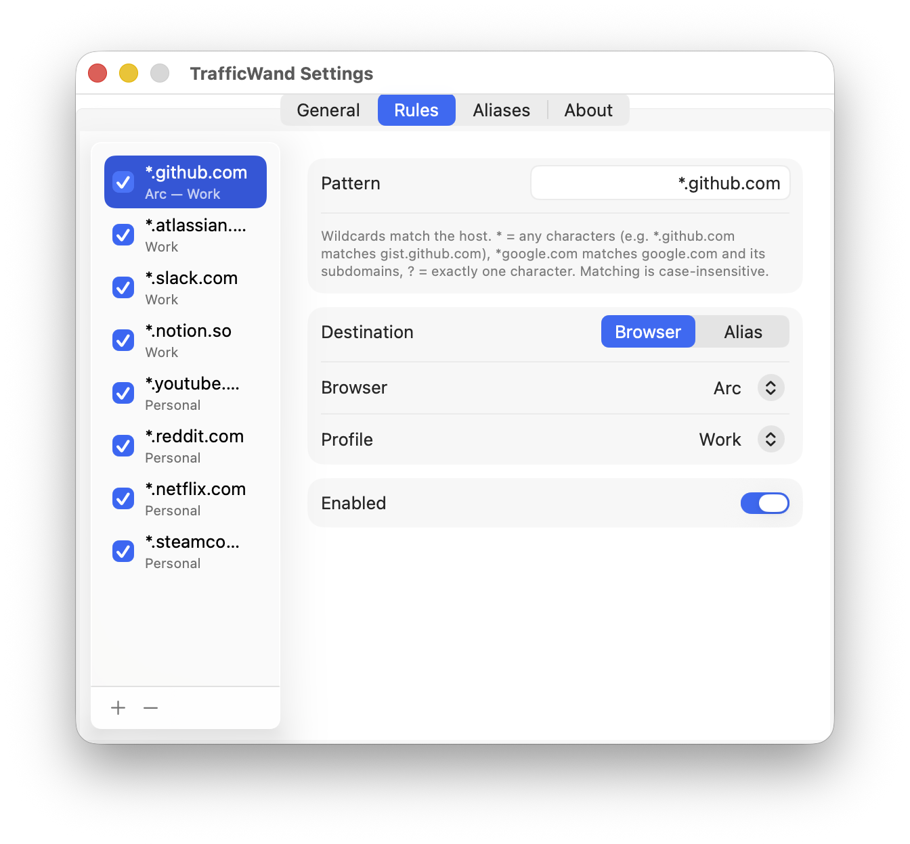
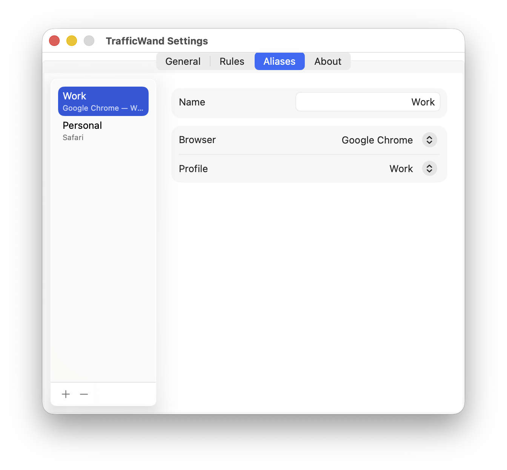

<h1 align="center"> TrafficWand</h1>
<p align="center"><strong>Open every link in the right browser.</strong></p>

<p align="center">
  <a href="../../releases/latest"></a>
  <a href="https://github.com/trafficwand/trafficwand/actions/workflows/ci.yml"></a>
  <a href="LICENSE"></a>
  
</p>

<picture>
  <source media="(prefers-color-scheme: dark)" srcset=".github/assets/screenshots/picker-dark.png">
  
</picture>

TrafficWand is a tiny menu-bar app that becomes your default browser. Click a link
anywhere on your Mac and it opens in the browser — and the profile — you picked for that
kind of link.

Write a rule like `*.github.com → Chrome "Work"` once and stop opening links in the wrong
window. No rule yet? A picker asks where the link should go — and remembers your choice.

TrafficWand is **free and open source**, collects **no data**, and runs on **macOS 26
(Tahoe) or later**.

<br clear="left">

## Download

**[Download the latest release](../../releases/latest)**, drag TrafficWand to
Applications, and launch it.

## Building from source

Needs [XcodeGen](https://github.com/yonaskolb/XcodeGen),
[SwiftLint](https://github.com/realm/SwiftLint), and [Task](https://taskfile.dev):

```sh
brew install xcodegen swiftlint
git clone https://github.com/trafficwand/trafficwand.git
cd trafficwand && task generate && task run
```

See [CONTRIBUTING.md](CONTRIBUTING.md) for build, release, and architecture details.

## How it works

1. **Make it your default browser** — one click in the menu bar, confirm the macOS prompt.
2. **Write a few rules** — e.g. `*.github.com → Chrome "Work"`, `*figma.com → Arc "Design"`.
   First match wins.
3. **Click links anywhere** — from Slack, Mail, your terminal — each one lands where it
   belongs.

## Features

- **Rules** — match sites based on domain masks.
- **Profiles** — keep work and personal stuff cleanly apart.
- **Aliases** — name a browser+profile once, re-use in rules.
- **Picker** — no rule yet? A panel asks where the link goes and can remember your choice.
- **Stays out of the way** — the app lives quietly in menu bar.

<details>
<summary><strong>Screenshots</strong></summary>

<br>

**Rules** — order your routing rules; first match wins.

<picture>
  <source media="(prefers-color-scheme: dark)" srcset=".github/assets/screenshots/rules-dark.png">
  
</picture>

**Profiles** — route to a specific browser profile per rule.

<picture>
  <source media="(prefers-color-scheme: dark)" srcset=".github/assets/screenshots/profiles-dark.png">
  
</picture>

**Aliases** — name a browser+profile once and reuse it.

<picture>
  <source media="(prefers-color-scheme: dark)" srcset=".github/assets/screenshots/aliases-dark.png">
  
</picture>

</details>

## FAQ

### How much does it cost?

Free and open source. [Sponsorship](https://github.com/sponsors/trafficwand) is welcome.

### What data do you collect?

None. The only network activity is checking GitHub for updates.

### Which browsers are supported?

Currently profile switching works for:
- Arc
- Brave
- Chrome
- Chromium
- Dia
- Edge
- Firefox
- Helium
- Vivaldi

Also, TrafficWand supports Comet and Safari, but currently without profile switching.

### How do I stop using it?

Set another default browser in **System Settings ▸ Desktop & Dock**, then move app from /Applications to the Trash — it leaves nothing behind.

### I Found a bug or have a feature request

[Open an issue](https://github.com/trafficwand/trafficwand/issues).

## License

MIT — see [LICENSE](LICENSE). © 2026 Ildar Karymov
